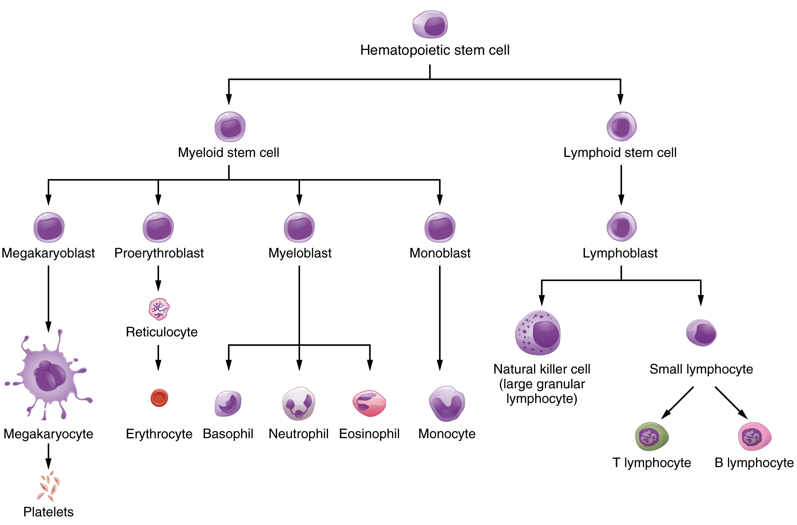

# immunology-notes
Notes on how the human immune system works

*References:*
- *https://www.microbiologybook.org/*
- *https://www.youtube.com/channel/UCFAQwnv2kGxl_2BOrI6790A*
- *https://www.khanacademy.org/science/biology/human-biology/circulatory-pulmonary/a/components-of-the-blood*
- *https://cnx.org/contents/GFy_h8cu@10.4:_XipwKIy@4/Components-of-the-Blood*
- *https://openstax.org/books/anatomy-and-physiology/pages/18-2-production-of-the-formed-elements*

### Introduction
Immunology is the study of our protection from foreign macromolecules or invading organisms and our responses to them. These invaders include viruses, bacteria, protozoa or even larger parasites. In addition, we can develop immune responses against our own proteins/molecules in autoimmunity and against our own aberrant cells in tumor immunity. The main function and challenge of the immune system is properly discriminating between what is self and what is foreign.

### Innate/Non-Specific Immunity
The innate immune system forms the first (anatomical) and second (humoral) lines of defense against invading organisms:
- **1st** line of defense - Anatomical barriers:

  - Skin: The epithelial surfaces form a physical barrier nearly impermeable to most infectious agents. Desquamation (skin peeling) also helps remove adhered bacteria and other infectious agents.
  - Tears, saliva, sweat: Liquid flushing helps prevent infection of the eyes and mouth. Contain enzymes and anti-microbial peptides that inhibit bacterial growth.
  - Mucus: Lining of the respiratory and gastrointestinal tract helps protect the lungs and digestive systems from infection

- **2nd** line of defense - Humoral (body fluid) barriers:

  - Complement system: Group of >20 plasma proteins that enhance/complement the ability of antibodies and phagocytic cells to clear pathogens. Non-specific defense functions include:
    - Opsonization: Flagging antigens for immune response
    - Inflammation: Attracting macrophages and neutrophils
    - Membrane attack: Rupturing cell walls of bacteria
  - Inflammation: White blood cell mediated increase in blood flow to the area of injury or infection, causing redness and warmth.
  - Coagulation: Blood clotting in case of physical damage to the area.
  - Lactoferrin and transferrin: Bind iron, an essential nutrient for bacteria, to limit bacterial growth.
  - Interferons: Limit virus replication in cells.
  - Lysozyme: Breaks down cell walls of bacteria.
  - Interleukin-1 (Il-1): Induces fever and the production of acute phase proteins, some of which are antimicrobial because they can opsonize bacteria.

### Adaptive/Acquired/Specific Immunity
- **3rd** line of defense:

  - Immunological memory allows for quicker and more efficient defense against pathogens a second time. It is slower to react than the innate immune response, but long-lasting.
  - The major histocompatibility complex (MHC) displays antigens for specific immune response, and comes in two flavors:
    - MHC class I: Expressed by all nucleated cells for displaying their inner protein contents on their surfaces. This allows the immune system to identify infected/cancerous cells from normal cells.
    - MHC class II: Expressed by professional antigen-presenting cells (dendritic cells, macrophages, B-cells) for displaying captured antigens to the specific immune system.
  - T lymphocytes (T-cells, mature in the thymus)
    - Cytotoxic T-cells (CD8+ T-cell): Kills infected/cancerous cells by binding their MHC-I presenting antigens with its T-cell receptor. CD8 confers the ability to bind MHC-I.
    - Helper T-cells (CD4+ T-cell): T-cell receptor binds foreign antigens (or those presented by MHC-II), triggering a cytokine alarm signal recruiting other immune cells. CD4 confers the ability to bind MHC-II, important for activating B-cells.
  - B lymphocytes (B-cells, mature in the bone marrow):
    - Each B-cell can only display one of ~1010 possible antibody combinations.
    - If the B-cell receptor (antibody) binds an antigen, it will be consumed by phagocytosis and its antigen content displayed by MHC-II. When the MHC-II-antigen complex is activated by a T-helper cell receptor specific for the antigen, the B-cell clones itself and differentiates:
      - Memory B-cell: Can survive for decades for an accelerated antibody-mediated immune response in the case of reinfection (secondary immune response).
      - Effector B-cell (Plasma cell): Factory for producing antibodies to opsonize pathogens.

### Components of Blood
- Plasma – 55%
  - 90% water, with the remaining 10% percent made up of electrolytes, nutrients, hormones, and proteins.
  - Albumin (main protein in human plasma) regulates osmotic pressure in blood vessels by displacing water.
  - Serum is plasma stripped of its clotting factors.

- Red Blood Cells (Erythrocytes) – 45%
  - O2 is transported from the lungs to the surrounding tissue.
  - CO2 is transported to the lungs to be released.

- Platelets (Thrombocytes) – <1%
  - Cell fragments broken off of megakaryocytes
  - Produce fibrin clots that prevent further blood loss at wound site.

- White Blood Cells (Leukocytes) – <1%

  

  - Granulocytes (irregularly shaped nuclei with 2-5 lobes):
    - Basophils: Roles in inflammation and allergic response
    - Eosinophils: Motile phagocytic cells capable of leaving the bloodstream and going into tissue to fight protozoan and helminthic parasites
    - Neutrophils: Most abundant leukocytes in blood (50-70%), also called polymorphonuclear (PMN) neutrophils. Active phagocytic cells, the first cells to migrate to the site of infection, but do not provide prolonged defense as they last only a few days
  - Agranulocytes (single nucleus with one lobe):
    - Monocytes: Largest type of leucocytes. Circulate in blood, and migrate into tissues where they differentiate into macrophages that become resident cells in the tissues (long-lived large white blood cells that engulf microbes)
      - Free macrophages: Motile and gather at site of infection/inflammation
      - Fixed macrophages: Resident at specific tissues
    - Lymphocytes: Main type of cells found in lymph
      - Large: Natural Killer Lymphocyte (NK cell): Attack and kill infected or cancerous body cells by secreting toxins onto their surfaces
      - Small (smallest leucocytes): B and T Lymphocytes (B-cells and T-cells)
  
- Hematopoietic stem cells: Precursor stem cell that matures into red blood cells, white blood cells, and platelet-producing cells (matured cell types are given the "cyte" suffix):

  

### Human Immunoglobulin Hierarchy

B-cell receptors and antibodies are both types of immunoglobulins. The difference is one is membrane bound and the other is secreted

**[1]** Immunoglobulin *Classes*/*Isotypes* (heavy constant region sequence classifications):
- IgG (γ):
  - 70-85% of Ig in serum
  - Monomer
  - Most versatile Ig capable of carrying out all of the functions of immunoglobulin molecules
  - *Subclasses*/*Subtypes* (smaller differences in heavy constant region sequences):
    - IgG1 - γ1 heavy chains
    - IgG2 - γ2 heavy chains
    - IgG3 - γ3 heavy chains
    - IgG4 - γ4 heavy chains
- IgA (α):
  - 5-15% of Ig in serum
  - Monomer in serum, dimer in secretions
  - Major class of Ig in secretions - tears, saliva, colostrum, mucus
  - *Subclasses*/*Subtypes* (smaller differences in heavy constant region sequences):
    - IgA1 - α1 heavy chains
    - IgA2 - α2 heavy chains
- IgM (μ):
  - 5-10% of Ig in serum
  - Normally a pentamer, but can also exist as a monomer
  - Good at clumping microorganisms together for eventual elimination from the body
- IgD (δ):
  - <1% of Ig in serum
  - Monomer
  - It's role in serum uncertain
- IgE (ε):
  - ~0% of Ig in serum
  - Monomer with extra constant region domain
  - Binds very tightly to Fc receptors and is involved in allergic reactions

**[2]** Immunoglobulin *Types* (light constant region sequence classifications):
- Kappa (κ) light chain (60% of Ig in serum)
- Lambda (λ) light chain (40% of Ig in serum)
  - *Subtypes*: λ1, λ2, λ3, λ4

**[3]** IMGT *Groups* (V(D)J genes of heavy and light chains, further divided into *Subgroups* of genes sharing at least 75% identity at the nucleotide level)
- Heavy chain (VDJ):
  - V-genes (*Subgroups*: IGHV1-IGHV8)
  - D-genes (*Subgroups*: IGHD1-IGHD7)
  - J-genes (*Subgroups*: IGHJ1-IGHJ6)
- Light chain (VJ):
  - V-genes (*Subgroups*: IGKV1-IGKV7, IGLV1-IGLV9)
  - J-genes: (*Subgroups*: IGKJ1-IGKJ5, IGLJ1-IGLJ7)

**[4]** IMGT *Genes* and *Alleles*
- *Genes*: DNA sequence that can be potentially transcribed and/or translated
- *Alleles*: Polymorphic mutant variants of a *Gene*, with *01 designated as the reference sequence
- Full nomenclature: IG<*Chain*><*Group*><*Subgroup*>-<*Gene*>*<*Alleles*>

### Cytokines
Proteins or glycoproteins (<30 kDa) that may be soluble or membrane bound. Small soluble molecules that act as intercellular mediators. They bind to cytokine receptors on the surface of other receptors
- Autocrine signaling: 
- Short half-life (mostly act over a short-distance)
- Types of cytokines:
  - Interleukins: Cytokines produced by leukocyte acting on another leucocyte (though cells other than leukocytes can use interleukins).
  - Tumor Necrosis Factor (TNF): Produced by mast cells, macrophages, and T cells. Often firmly anchored to the membrane. Responsible for apoptosis of many cell types. TNFα is released by macrophages to activate neutrophils by binding their cytokine receptors.
  - Interferons (interfere with viral replication):
    - When a cell gets infected by a virus, it sends a distress signal (interferons) that stimulate uninfected cells to produce anti-viral proteins to suppress the spread of the viral infection.
    - Type I: IFN-α, IFN-β (produced in response to viral infection)
    - Type II: IFN-γ (increases phagocytosis by macrophages)
  - Colony-Stimulating Factors (CSF): Essential for the growth and differentiation of immature leukocytes in the bone marrow (red blood cells, monocytes, granulocytes, and lymphocytes). It ensures the body is supplied with sufficient supplies of white blood cells of all types
  - Chemokines: Act as chemo-attractants and signal leucocytes to move. For example, they may be released at the site of infection to signal neutrophils to come and become the principle phagocytic cell at the site of infection.
