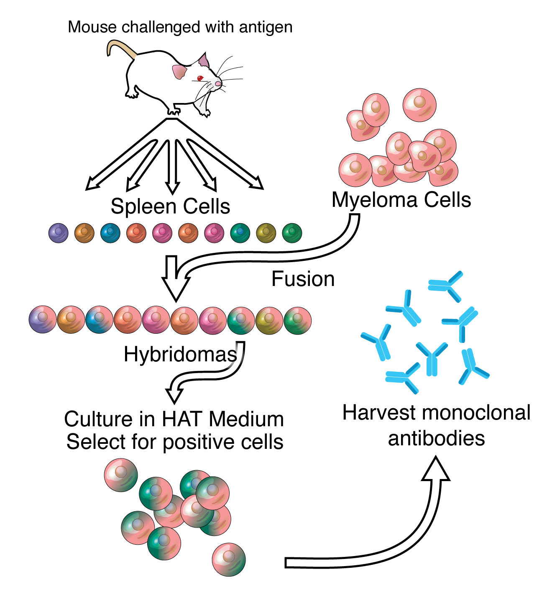

# immunization
Notes on how mouse immunizations works

*References:*
- *https://prosci-services.com/antibody-development-guide/freunds-adjuvant/*
- *https://www.sinobiological.com/resource/antibody-technical/hybridoma-technology*

### Definitions
- Emulsion: Mixture of two or more liquids that are normally immiscible, creating a dispersion of a liquid called the dispersed phase in a second liquid called the continuous phase
- Freund's Adjuvant: One of the most commonly used adjuvants in animal research for triggering a humoral antibody inflammatory response for the production of high titer antibodies
  - Complete Freund’s Adjuvant (CFA):
    - Water in oil emulsion that contains inactivated mycobacteria
    - Depot effect: Mixing with immunogen forms a stable emulsion with sustained presentation of the antigen
    - Can cause severe pain at the injection site
    - Generally recommended as only being used for the initial injection
  - Incomplete Freund’s Adjuvant (IFA):
    - Just a water in oil emulsion that does not contain inactivated mycobacteria
    - Can be used for subsequent injections because the side effects tend to be less severe than CFA

### Types of Injections

*Intraperitoneal injection in mice – lower right quadrant of the abdomen to reduce the chances of damage to the urinary bladder, cecum and other abdominal organs

### Standard Immunization Schedule
- Day -7: Acclimate mice for at least 7 days before immunization
- Day 0: Inject up to 100 ug immunogen emulsified in CFA in PBS total volume 100-200 uL (300 uL max)
- Day 14: Inject booster shot with IFA as adjuvant
- Day 28: Inject booster shot without adjuvant
- Day 35: Inject final booster shot with 100-200 ug immunogen and sacrifice mice 3-4 days later

(Collect tail bleeds throughout immunization program to measure serum titers)

### Serum Titers
- Collect no more than 1% of the mouse body weight every 24 hours (25g mouse x 1% = 250uL max tail bleed)
- Make serial dilutions of the resulting serum in PBS
- Test mouse serum samples in an ELISA assay against the antigen

### Hybridoma Cell Lines

Hybridoma technology is a method for producing monoclonal antibodies (mAbs) from B-cells. First, fusion between short-lived antibody-producing B-cells and immortal myeloma cells produces hybridoma cell lines. Each hybridoma expresses one specific mAb, and hybridoma cell lines selected for can be cryopreserved for long-lasting mAb production.